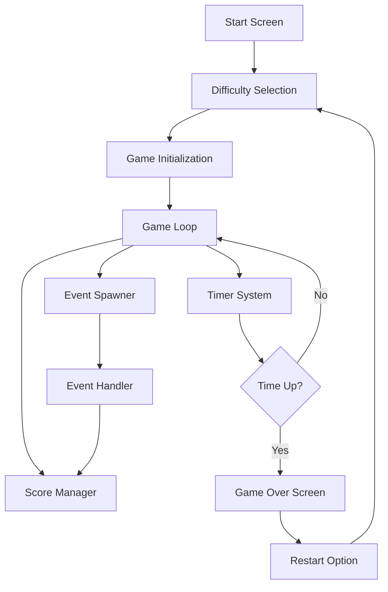
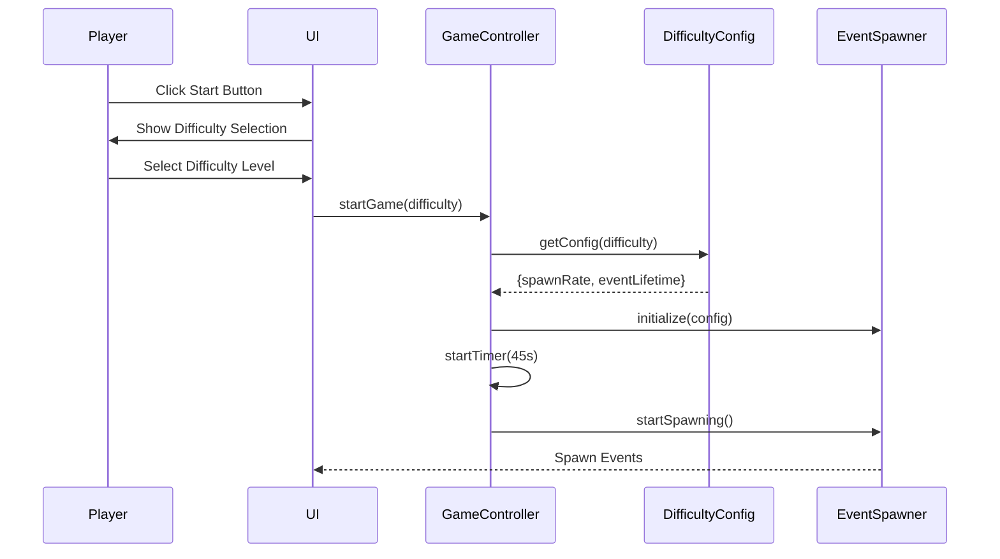
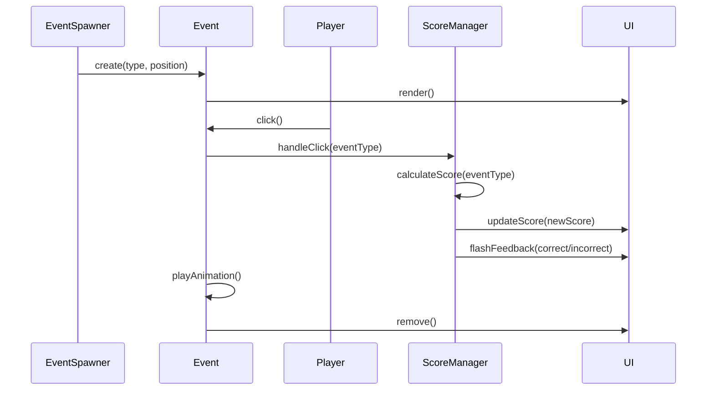
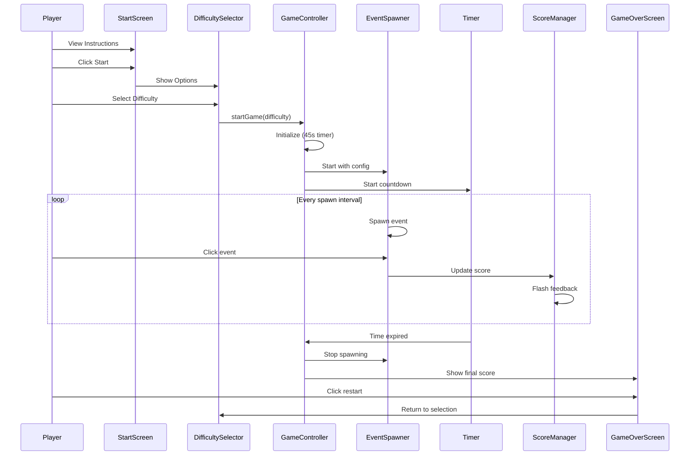

# Design Document: Enhanced Engineering Whack-a-Mole Game

## Overview

This design enhances the existing Engineering Whack-a-Mole game by introducing three difficulty levels (Easy, Intermediate, Hard) with varying spawn rates, extending the game duration from 30 to 45 seconds, and improving the visual experience with a game platform background theme and attractive thematic images. The enhancement maintains the core gameplay mechanics while providing players with customizable challenge levels and a more immersive visual experience.

The difficulty system will be implemented through configurable spawn rate intervals and event lifetimes, allowing players to select their preferred challenge level before starting the game. The UI will be updated with a gaming platform aesthetic featuring circuit board patterns, tech-themed backgrounds, and engineering-related imagery to create a more engaging and cohesive visual experience.

## Architecture



## Sequence Diagrams

### Game Start Flow with Difficulty Selection



### Event Interaction Flow



## Components and Interfaces

### Component 1: DifficultyManager

**Purpose**: Manages difficulty level configuration and provides spawn rate settings

**Interface**:
```javascript
interface DifficultyConfig {
  spawnRate: number;        // Milliseconds between spawns
  eventLifetime: number;    // Milliseconds event stays visible
  label: string;            // Display name
  description: string;      // User-facing description
}

interface DifficultyManager {
  getConfig(level: DifficultyLevel): DifficultyConfig;
  getCurrentDifficulty(): DifficultyLevel;
  setDifficulty(level: DifficultyLevel): void;
}

enum DifficultyLevel {
  EASY = 'easy',
  INTERMEDIATE = 'intermediate',
  HARD = 'hard'
}
```

**Responsibilities**:
- Store difficulty configuration presets
- Provide spawn rate and event lifetime parameters
- Validate difficulty level selections
- Maintain current difficulty state


### Component 2: GameController

**Purpose**: Orchestrates game state, timer, and event spawning

**Interface**:
```javascript
interface GameController {
  startGame(difficulty: DifficultyLevel): void;
  endGame(): void;
  restartGame(): void;
  pauseGame(): void;
  resumeGame(): void;
  getGameState(): GameState;
  getScore(): number;
  getTimeRemaining(): number;
}

enum GameState {
  IDLE = 'idle',
  DIFFICULTY_SELECTION = 'difficulty_selection',
  RUNNING = 'running',
  PAUSED = 'paused',
  ENDED = 'ended'
}
```

**Responsibilities**:
- Manage game state transitions
- Initialize game with selected difficulty
- Control timer countdown (45 seconds)
- Coordinate event spawning
- Handle game end conditions
- Manage restart functionality

### Component 3: EventSpawner

**Purpose**: Creates and manages event spawning based on difficulty settings

**Interface**:
```javascript
interface EventSpawner {
  initialize(config: DifficultyConfig): void;
  startSpawning(): void;
  stopSpawning(): void;
  spawnEvent(): Event;
  clearAllEvents(): void;
}

interface Event {
  id: string;
  type: EventType;
  text: string;
  position: Position;
  lifetime: number;
  onClick: (event: Event) => void;
  remove(): void;
}

enum EventType {
  BAD = 'bad',    // Bugs and anti-patterns (+10 points)
  GOOD = 'good'   // Good practices (-5 points)
}

interface Position {
  x: number;
  y: number;
}
```

**Responsibilities**:
- Spawn events at configured intervals
- Randomly select event type and text
- Calculate random positions within safe boundaries
- Auto-remove events after lifetime expires
- Clear all events on game end

### Component 4: ScoreManager

**Purpose**: Tracks and updates player score with visual feedback

**Interface**:
```javascript
interface ScoreManager {
  addPoints(points: number): void;
  subtractPoints(points: number): void;
  getScore(): number;
  resetScore(): void;
  handleEventClick(eventType: EventType): number;
}

interface ScoreFeedback {
  type: FeedbackType;
  duration: number;
}

enum FeedbackType {
  CORRECT = 'correct',
  INCORRECT = 'incorrect'
}
```

**Responsibilities**:
- Maintain current score
- Calculate score changes based on event type
- Trigger visual feedback animations
- Prevent negative scores
- Provide score for game over display

### Component 5: UIManager

**Purpose**: Manages all UI updates, animations, and visual themes

**Interface**:
```javascript
interface UIManager {
  showStartScreen(): void;
  showDifficultySelection(): void;
  showGameScreen(): void;
  showGameOverScreen(finalScore: number): void;
  updateScore(score: number): void;
  updateTimer(timeLeft: number): void;
  flashScoreFeedback(type: FeedbackType): void;
  renderEvent(event: Event): HTMLElement;
  removeEvent(eventId: string): void;
  applyTheme(): void;
}

interface Theme {
  backgroundImages: string[];
  primaryColor: string;
  accentColor: string;
  eventIcons: EventIcons;
}

interface EventIcons {
  bad: string;    // Icon/emoji for bad events
  good: string;   // Icon/emoji for good events
}
```

**Responsibilities**:
- Render all UI screens and transitions
- Update HUD elements (score, timer)
- Apply game platform background theme
- Manage event rendering and animations
- Handle visual feedback effects
- Display difficulty selection interface

## Data Models

### Model 1: GameConfig

```javascript
interface GameConfig {
  gameDuration: number;           // 45 seconds
  difficulties: DifficultyConfig[];
  scoring: ScoringRules;
  events: EventData;
  theme: Theme;
}

interface ScoringRules {
  badEventPoints: number;    // +10
  goodEventPoints: number;   // -5
  minimumScore: number;      // 0
}

interface EventData {
  badEvents: string[];
  goodEvents: string[];
  spawnProbability: number;  // 0.5 (50% chance for each type)
}
```

**Validation Rules**:
- gameDuration must be positive integer (45)
- badEventPoints must be positive
- goodEventPoints must be negative
- minimumScore must be non-negative
- spawnProbability must be between 0 and 1
- Event arrays must contain at least 5 items each

### Model 2: DifficultyConfig

```javascript
interface DifficultyConfig {
  level: DifficultyLevel;
  spawnRate: number;        // Milliseconds between spawns
  eventLifetime: number;    // Milliseconds event stays visible
  label: string;
  description: string;
}

// Preset configurations
const DIFFICULTY_PRESETS: Record<DifficultyLevel, DifficultyConfig> = {
  easy: {
    level: DifficultyLevel.EASY,
    spawnRate: 1200,        // Slower than original (was 800ms)
    eventLifetime: 2500,    // Longer visibility
    label: 'Easy',
    description: 'Relaxed pace for beginners'
  },
  intermediate: {
    level: DifficultyLevel.INTERMEDIATE,
    spawnRate: 900,         // Slightly faster than easy
    eventLifetime: 2000,    // Original lifetime
    label: 'Intermediate',
    description: 'Balanced challenge'
  },
  hard: {
    level: DifficultyLevel.HARD,
    spawnRate: 600,         // Faster than original
    eventLifetime: 1500,    // Shorter visibility
    label: 'Hard',
    description: 'Fast-paced action'
  }
};
```

**Validation Rules**:
- spawnRate must be positive integer (300-2000ms range)
- eventLifetime must be positive integer (1000-3000ms range)
- eventLifetime should be greater than spawnRate
- label must be non-empty string
- level must be valid DifficultyLevel enum value

### Model 3: GameState

```javascript
interface GameStateData {
  state: GameState;
  score: number;
  timeRemaining: number;
  difficulty: DifficultyLevel;
  activeEvents: Event[];
  startTime: number;
  endTime: number | null;
}
```

**Validation Rules**:
- score must be non-negative integer
- timeRemaining must be between 0 and 45
- activeEvents array must not exceed 20 items
- startTime must be valid timestamp
- endTime must be null or valid timestamp after startTime

## Main Algorithm/Workflow




## Key Functions with Formal Specifications

### Function 1: startGame()

```javascript
function startGame(difficulty: DifficultyLevel): void
```

**Preconditions:**
- `difficulty` is a valid DifficultyLevel enum value (EASY, INTERMEDIATE, or HARD)
- Game state is IDLE or DIFFICULTY_SELECTION
- No active game intervals are running

**Postconditions:**
- Game state transitions to RUNNING
- Timer is initialized to 45 seconds
- Score is reset to 0
- Event spawner is initialized with difficulty config
- Spawn interval is started based on difficulty
- Timer countdown interval is started
- All UI elements are updated to show game screen

**Loop Invariants:** N/A (no loops in function body)

### Function 2: spawnEvent()

```javascript
function spawnEvent(): Event
```

**Preconditions:**
- Game state is RUNNING
- EventSpawner is initialized with valid DifficultyConfig
- Game container DOM element exists

**Postconditions:**
- New Event object is created with random type (BAD or GOOD)
- Event is positioned randomly within safe boundaries
- Event is rendered in the DOM
- Event has click handler attached
- Auto-removal timer is set based on eventLifetime
- Returns the created Event object

**Loop Invariants:** N/A

### Function 3: handleEventClick()

```javascript
function handleEventClick(event: Event): number
```

**Preconditions:**
- `event` is a valid Event object with defined type
- Game state is RUNNING
- Event has not been clicked before

**Postconditions:**
- Score is updated based on event type:
  - If event.type === BAD: score increases by 10
  - If event.type === GOOD: score decreases by 5 (minimum 0)
- Visual feedback animation is triggered
- Event is marked as clicked and removed from DOM
- Returns the new score value

**Loop Invariants:** N/A

### Function 4: updateTimer()

```javascript
function updateTimer(): void
```

**Preconditions:**
- Game state is RUNNING
- Timer interval is active
- timeRemaining is between 0 and 45

**Postconditions:**
- timeRemaining is decremented by 1
- Timer display is updated in UI
- If timeRemaining reaches 0:
  - Game state transitions to ENDED
  - endGame() is called
  - All intervals are cleared

**Loop Invariants:** 
- For timer interval loop: 0 ≤ timeRemaining ≤ 45

### Function 5: getDifficultyConfig()

```javascript
function getDifficultyConfig(level: DifficultyLevel): DifficultyConfig
```

**Preconditions:**
- `level` is a valid DifficultyLevel enum value

**Postconditions:**
- Returns DifficultyConfig object with valid spawnRate and eventLifetime
- Returned config matches the preset for the specified level
- No side effects on game state

**Loop Invariants:** N/A

## Algorithmic Pseudocode

### Main Game Loop Algorithm

```javascript
// Game initialization and main loop
function initializeGame(difficulty) {
  // INPUT: difficulty level (EASY, INTERMEDIATE, or HARD)
  // OUTPUT: Running game with configured difficulty
  
  // PRECONDITION: difficulty is valid enum value
  // POSTCONDITION: Game is running with 45-second timer
  
  // Step 1: Get difficulty configuration
  const config = getDifficultyConfig(difficulty);
  
  // Step 2: Initialize game state
  gameState = GameState.RUNNING;
  score = 0;
  timeRemaining = 45;
  activeEvents = [];
  
  // Step 3: Update UI
  hideStartScreen();
  showGameScreen();
  updateScoreDisplay(score);
  updateTimerDisplay(timeRemaining);
  
  // Step 4: Start timer countdown
  timerInterval = setInterval(() => {
    // LOOP INVARIANT: 0 <= timeRemaining <= 45
    timeRemaining--;
    updateTimerDisplay(timeRemaining);
    
    if (timeRemaining <= 0) {
      endGame();
    }
  }, 1000);
  
  // Step 5: Start event spawning
  spawnInterval = setInterval(() => {
    if (gameState === GameState.RUNNING) {
      spawnEvent();
    }
  }, config.spawnRate);
  
  // POSTCONDITION: Game is running with active intervals
}
```

**Preconditions:**
- difficulty parameter is valid DifficultyLevel
- DOM elements are loaded and accessible
- No active game is running

**Postconditions:**
- Game state is RUNNING
- Timer countdown is active (45 seconds)
- Event spawning is active at configured rate
- UI displays game screen with initial values

**Loop Invariants:**
- Timer loop: 0 ≤ timeRemaining ≤ 45
- Spawn loop: gameState remains RUNNING until timer expires

### Event Spawning Algorithm

```javascript
// Event spawning with position calculation
function spawnEvent() {
  // INPUT: None (uses current game state and config)
  // OUTPUT: New event rendered in DOM
  
  // PRECONDITION: gameState === RUNNING
  // POSTCONDITION: Event is visible and interactive
  
  // Step 1: Determine event type randomly
  const isBad = Math.random() > 0.5;
  const eventType = isBad ? EventType.BAD : EventType.GOOD;
  
  // Step 2: Select random event text
  const eventList = isBad ? badEvents : goodEvents;
  const eventText = eventList[Math.floor(Math.random() * eventList.length)];
  
  // Step 3: Calculate safe position
  const maxX = window.innerWidth - 250;   // Account for event width
  const maxY = window.innerHeight - 150;  // Account for event height
  const minY = 100;                       // Below HUD
  
  const position = {
    x: Math.random() * maxX,
    y: Math.random() * (maxY - minY) + minY
  };
  
  // LOOP INVARIANT: position.x in [0, maxX], position.y in [minY, maxY]
  
  // Step 4: Create event object
  const event = {
    id: generateUniqueId(),
    type: eventType,
    text: eventText,
    position: position,
    lifetime: currentConfig.eventLifetime
  };
  
  // Step 5: Render event in DOM
  const eventElement = createEventElement(event);
  gameContainer.appendChild(eventElement);
  activeEvents.push(event);
  
  // Step 6: Set auto-removal timer
  setTimeout(() => {
    if (eventElement.parentNode && gameState === GameState.RUNNING) {
      removeEvent(event.id);
    }
  }, event.lifetime);
  
  // POSTCONDITION: Event is rendered and will auto-remove after lifetime
}
```

**Preconditions:**
- gameState is RUNNING
- currentConfig contains valid DifficultyConfig
- gameContainer DOM element exists
- Event lists (badEvents, goodEvents) are non-empty

**Postconditions:**
- New event is rendered at random valid position
- Event is added to activeEvents array
- Auto-removal timer is set
- Event has click handler attached

**Loop Invariants:**
- Position calculation: position.x ∈ [0, maxX] ∧ position.y ∈ [minY, maxY]

### Score Calculation Algorithm

```javascript
// Score update with validation
function handleEventClick(event) {
  // INPUT: event object with type property
  // OUTPUT: Updated score value
  
  // PRECONDITION: event.type is valid EventType
  // PRECONDITION: gameState === RUNNING
  // POSTCONDITION: score >= 0 (never negative)
  
  // Step 1: Calculate score change
  let scoreChange = 0;
  
  if (event.type === EventType.BAD) {
    scoreChange = 10;  // Correct click
  } else if (event.type === EventType.GOOD) {
    scoreChange = -5;  // Incorrect click
  }
  
  // Step 2: Update score with minimum constraint
  const newScore = Math.max(0, score + scoreChange);
  score = newScore;
  
  // INVARIANT: score >= 0
  
  // Step 3: Trigger visual feedback
  const feedbackType = scoreChange > 0 ? 
    FeedbackType.CORRECT : FeedbackType.INCORRECT;
  flashScoreFeedback(feedbackType);
  
  // Step 4: Update UI
  updateScoreDisplay(score);
  
  // Step 5: Remove event with animation
  event.element.classList.add('clicked');
  setTimeout(() => {
    removeEvent(event.id);
  }, 300);
  
  // POSTCONDITION: score is updated and >= 0
  return score;
}
```

**Preconditions:**
- event parameter is valid Event object
- event.type is either BAD or GOOD
- gameState is RUNNING
- Event has not been clicked before

**Postconditions:**
- score is updated correctly based on event type
- score remains non-negative (≥ 0)
- Visual feedback is displayed
- Event is removed from DOM and activeEvents array
- Returns new score value

**Loop Invariants:** N/A (no loops)

### Difficulty Selection Algorithm

```javascript
// Difficulty configuration retrieval
function getDifficultyConfig(level) {
  // INPUT: level (DifficultyLevel enum)
  // OUTPUT: DifficultyConfig object
  
  // PRECONDITION: level is valid DifficultyLevel
  // POSTCONDITION: Returns valid config with spawnRate and eventLifetime
  
  const configs = {
    [DifficultyLevel.EASY]: {
      spawnRate: 1200,
      eventLifetime: 2500,
      label: 'Easy',
      description: 'Relaxed pace for beginners'
    },
    [DifficultyLevel.INTERMEDIATE]: {
      spawnRate: 900,
      eventLifetime: 2000,
      label: 'Intermediate',
      description: 'Balanced challenge'
    },
    [DifficultyLevel.HARD]: {
      spawnRate: 600,
      eventLifetime: 1500,
      label: 'Hard',
      description: 'Fast-paced action'
    }
  };
  
  // INVARIANT: All configs have spawnRate > 0 and eventLifetime > 0
  
  const config = configs[level];
  
  // Validation
  if (!config || config.spawnRate <= 0 || config.eventLifetime <= 0) {
    throw new Error('Invalid difficulty configuration');
  }
  
  // POSTCONDITION: config is valid and complete
  return config;
}
```

**Preconditions:**
- level is a valid DifficultyLevel enum value (EASY, INTERMEDIATE, or HARD)

**Postconditions:**
- Returns DifficultyConfig object with positive spawnRate and eventLifetime
- Config matches the preset for specified level
- No mutations to global state

**Loop Invariants:** N/A


## Example Usage

### Example 1: Starting Game with Difficulty Selection

```javascript
// Player selects difficulty and starts game
const difficultyButtons = document.querySelectorAll('.difficulty-btn');

difficultyButtons.forEach(button => {
  button.addEventListener('click', (e) => {
    const selectedDifficulty = e.target.dataset.difficulty;
    startGame(selectedDifficulty);
  });
});

function startGame(difficulty) {
  const config = getDifficultyConfig(difficulty);
  console.log(`Starting game with ${config.label} difficulty`);
  // config.spawnRate: 1200 (Easy), 900 (Intermediate), or 600 (Hard)
  // config.eventLifetime: 2500 (Easy), 2000 (Intermediate), or 1500 (Hard)
  
  initializeGame(config);
}
```

### Example 2: Event Spawning Based on Difficulty

```javascript
// Easy mode: Slower spawning
const easyConfig = getDifficultyConfig(DifficultyLevel.EASY);
setInterval(() => {
  spawnEvent();
}, easyConfig.spawnRate); // 1200ms - spawns every 1.2 seconds

// Hard mode: Faster spawning
const hardConfig = getDifficultyConfig(DifficultyLevel.HARD);
setInterval(() => {
  spawnEvent();
}, hardConfig.spawnRate); // 600ms - spawns every 0.6 seconds
```

### Example 3: Complete Game Flow

```javascript
// Initialize game system
const gameController = new GameController();
const difficultyManager = new DifficultyManager();
const scoreManager = new ScoreManager();

// Show start screen
gameController.showStartScreen();

// Player clicks start
document.getElementById('startButton').addEventListener('click', () => {
  gameController.showDifficultySelection();
});

// Player selects difficulty
document.querySelectorAll('.difficulty-option').forEach(option => {
  option.addEventListener('click', (e) => {
    const difficulty = e.target.dataset.level;
    difficultyManager.setDifficulty(difficulty);
    gameController.startGame(difficulty);
  });
});

// Game runs for 45 seconds
// Events spawn at difficulty-specific intervals
// Player clicks events, score updates

// Game ends
gameController.on('gameEnd', (finalScore) => {
  gameController.showGameOverScreen(finalScore);
});

// Player restarts
document.getElementById('restartButton').addEventListener('click', () => {
  gameController.showDifficultySelection();
});
```

### Example 4: Difficulty Configuration Usage

```javascript
// Get configuration for each difficulty level
const difficulties = [
  DifficultyLevel.EASY,
  DifficultyLevel.INTERMEDIATE,
  DifficultyLevel.HARD
];

difficulties.forEach(level => {
  const config = getDifficultyConfig(level);
  console.log(`${config.label}:`);
  console.log(`  Spawn Rate: ${config.spawnRate}ms`);
  console.log(`  Event Lifetime: ${config.eventLifetime}ms`);
  console.log(`  Description: ${config.description}`);
});

// Output:
// Easy:
//   Spawn Rate: 1200ms
//   Event Lifetime: 2500ms
//   Description: Relaxed pace for beginners
// Intermediate:
//   Spawn Rate: 900ms
//   Event Lifetime: 2000ms
//   Description: Balanced challenge
// Hard:
//   Spawn Rate: 600ms
//   Event Lifetime: 1500ms
//   Description: Fast-paced action
```

### Example 5: Theme Application

```javascript
// Apply game platform theme with background images
function applyGameTheme() {
  const theme = {
    backgroundImages: [
      'url("data:image/svg+xml,...")', // Circuit board pattern
      'radial-gradient(circle at 20% 50%, rgba(59, 130, 246, 0.3) 0%, transparent 50%)',
      'radial-gradient(circle at 80% 80%, rgba(6, 182, 212, 0.3) 0%, transparent 50%)'
    ],
    primaryColor: '#1e3a8a',
    accentColor: '#3b82f6',
    eventIcons: {
      bad: '🐛',
      good: '✨'
    }
  };
  
  document.body.style.background = theme.backgroundImages.join(', ');
  document.documentElement.style.setProperty('--primary-color', theme.primaryColor);
  document.documentElement.style.setProperty('--accent-color', theme.accentColor);
}
```

## Correctness Properties

### Property 1: Game Duration Invariant
**Universal Quantification**: ∀ games g, when g starts, timer initializes to 45 seconds and decrements by 1 every second until reaching 0, at which point the game ends.

**Formal Statement**: 
```
∀g ∈ Games: startGame(g) ⟹ 
  (g.timeRemaining = 45 ∧ 
   ∀t ∈ [0, 45]: g.timeRemaining(t) = 45 - t ∧
   g.timeRemaining = 0 ⟹ endGame(g))
```

### Property 2: Difficulty Configuration Validity
**Universal Quantification**: ∀ difficulty levels d, the configuration returned has positive spawn rate and event lifetime values within valid ranges.

**Formal Statement**:
```
∀d ∈ {EASY, INTERMEDIATE, HARD}: 
  let config = getDifficultyConfig(d) in
    300 ≤ config.spawnRate ≤ 2000 ∧
    1000 ≤ config.eventLifetime ≤ 3000 ∧
    config.spawnRate > 0 ∧
    config.eventLifetime > 0
```

### Property 3: Score Non-Negativity
**Universal Quantification**: ∀ game states s, the score never becomes negative regardless of player actions.

**Formal Statement**:
```
∀s ∈ GameStates: s.score ≥ 0 ∧
  ∀e ∈ Events: handleEventClick(e) ⟹ s.score' ≥ 0
```

### Property 4: Event Position Validity
**Universal Quantification**: ∀ spawned events e, the position is within visible viewport boundaries and does not overlap with HUD elements.

**Formal Statement**:
```
∀e ∈ SpawnedEvents:
  0 ≤ e.position.x ≤ (viewport.width - 250) ∧
  100 ≤ e.position.y ≤ (viewport.height - 150)
```

### Property 5: Difficulty Ordering
**Universal Quantification**: The spawn rates follow strict ordering: Easy > Intermediate > Hard (slower to faster).

**Formal Statement**:
```
let easy = getDifficultyConfig(EASY),
    intermediate = getDifficultyConfig(INTERMEDIATE),
    hard = getDifficultyConfig(HARD) in
  easy.spawnRate > intermediate.spawnRate > hard.spawnRate ∧
  easy.eventLifetime > intermediate.eventLifetime > hard.eventLifetime
```

### Property 6: Event Lifecycle
**Universal Quantification**: ∀ events e, each event is automatically removed after its lifetime expires or when clicked, whichever occurs first.

**Formal Statement**:
```
∀e ∈ ActiveEvents:
  (elapsed(e) ≥ e.lifetime ∨ clicked(e)) ⟹ removed(e) ∧
  removed(e) ⟹ e ∉ ActiveEvents
```

### Property 7: State Transition Validity
**Universal Quantification**: Game state transitions follow valid paths and never skip required states.

**Formal Statement**:
```
∀transitions (s₁, s₂):
  validTransitions = {
    (IDLE, DIFFICULTY_SELECTION),
    (DIFFICULTY_SELECTION, RUNNING),
    (RUNNING, ENDED),
    (ENDED, DIFFICULTY_SELECTION)
  } ∧
  (s₁, s₂) ∈ validTransitions
```

### Property 8: Score Calculation Correctness
**Universal Quantification**: ∀ event clicks, score changes match the defined rules: +10 for bad events, -5 for good events (minimum 0).

**Formal Statement**:
```
∀e ∈ Events, ∀s ∈ GameStates:
  (e.type = BAD ⟹ s.score' = s.score + 10) ∧
  (e.type = GOOD ⟹ s.score' = max(0, s.score - 5))
```

## Error Handling

### Error Scenario 1: Invalid Difficulty Selection

**Condition**: User attempts to start game with invalid or undefined difficulty level
**Response**: 
- Display error message: "Please select a valid difficulty level"
- Prevent game initialization
- Keep difficulty selection screen visible
**Recovery**: 
- User can select a valid difficulty option
- No game state corruption occurs

### Error Scenario 2: Timer Synchronization Issue

**Condition**: Timer interval becomes desynchronized or fails to decrement
**Response**:
- Detect timer anomaly (timeRemaining unchanged for >2 seconds)
- Force game end with current score
- Log error for debugging
**Recovery**:
- Display game over screen with current score
- Allow restart with fresh timer

### Error Scenario 3: Event Spawning Failure

**Condition**: Event cannot be created or positioned due to DOM issues
**Response**:
- Catch exception during event creation
- Log error details
- Continue game without crashing
- Skip failed spawn attempt
**Recovery**:
- Next spawn interval attempts new event
- Game continues normally

### Error Scenario 4: Viewport Resize During Gameplay

**Condition**: Browser window is resized while game is running, potentially placing events outside visible area
**Response**:
- Detect resize event
- Recalculate safe boundaries
- Remove events outside new boundaries
- Continue spawning with updated constraints
**Recovery**:
- Game adapts to new viewport size
- No events spawn outside visible area

### Error Scenario 5: Rapid Click Exploitation

**Condition**: Player attempts to click same event multiple times rapidly
**Response**:
- Mark event as clicked immediately on first click
- Disable further click handlers on that event
- Prevent score manipulation
**Recovery**:
- Only first click registers
- Event is removed normally
- Score integrity maintained

## Testing Strategy

### Unit Testing Approach

**Key Test Cases**:

1. **Difficulty Configuration Tests**
   - Verify each difficulty level returns correct spawn rate
   - Validate spawn rate ordering (Easy > Intermediate > Hard)
   - Ensure event lifetime values are within valid ranges
   - Test invalid difficulty level handling

2. **Timer Tests**
   - Verify timer initializes to 45 seconds
   - Confirm timer decrements by 1 per second
   - Test game ends when timer reaches 0
   - Validate timer display updates correctly

3. **Score Calculation Tests**
   - Test bad event click adds 10 points
   - Test good event click subtracts 5 points
   - Verify score never goes below 0
   - Test score display updates correctly

4. **Event Spawning Tests**
   - Verify events spawn at correct intervals for each difficulty
   - Test random position generation within boundaries
   - Confirm events auto-remove after lifetime
   - Validate event type distribution (approximately 50/50)

5. **State Management Tests**
   - Test valid state transitions
   - Verify invalid transitions are prevented
   - Test game restart resets all state correctly

**Coverage Goals**: 
- Minimum 90% code coverage
- 100% coverage for score calculation and difficulty configuration
- All error handling paths tested

### Property-Based Testing Approach

**Property Test Library**: fast-check (for JavaScript)

**Property Tests**:

1. **Score Non-Negativity Property**
   ```javascript
   // Property: Score never goes negative regardless of event sequence
   fc.assert(
     fc.property(
       fc.array(fc.constantFrom('bad', 'good'), { minLength: 1, maxLength: 100 }),
       (eventSequence) => {
         const game = new GameController();
         game.startGame(DifficultyLevel.EASY);
         
         eventSequence.forEach(eventType => {
           game.handleEventClick({ type: eventType });
         });
         
         return game.getScore() >= 0;
       }
     )
   );
   ```

2. **Difficulty Ordering Property**
   ```javascript
   // Property: Spawn rates maintain strict ordering
   fc.assert(
     fc.property(
       fc.constantFrom(DifficultyLevel.EASY, DifficultyLevel.INTERMEDIATE, DifficultyLevel.HARD),
       fc.constantFrom(DifficultyLevel.EASY, DifficultyLevel.INTERMEDIATE, DifficultyLevel.HARD),
       (level1, level2) => {
         const config1 = getDifficultyConfig(level1);
         const config2 = getDifficultyConfig(level2);
         
         const ordering = {
           [DifficultyLevel.EASY]: 3,
           [DifficultyLevel.INTERMEDIATE]: 2,
           [DifficultyLevel.HARD]: 1
         };
         
         if (ordering[level1] > ordering[level2]) {
           return config1.spawnRate > config2.spawnRate;
         } else if (ordering[level1] < ordering[level2]) {
           return config1.spawnRate < config2.spawnRate;
         }
         return true;
       }
     )
   );
   ```

3. **Event Position Validity Property**
   ```javascript
   // Property: All spawned events are within viewport boundaries
   fc.assert(
     fc.property(
       fc.integer({ min: 800, max: 2560 }), // viewport width
       fc.integer({ min: 600, max: 1440 }), // viewport height
       (viewportWidth, viewportHeight) => {
         const spawner = new EventSpawner();
         const events = [];
         
         for (let i = 0; i < 50; i++) {
           const event = spawner.spawnEvent();
           events.push(event);
         }
         
         return events.every(e => 
           e.position.x >= 0 && 
           e.position.x <= viewportWidth - 250 &&
           e.position.y >= 100 && 
           e.position.y <= viewportHeight - 150
         );
       }
     )
   );
   ```

4. **Timer Countdown Property**
   ```javascript
   // Property: Timer always counts down from 45 to 0
   fc.assert(
     fc.property(
       fc.constantFrom(DifficultyLevel.EASY, DifficultyLevel.INTERMEDIATE, DifficultyLevel.HARD),
       (difficulty) => {
         const game = new GameController();
         const timerValues = [];
         
         game.startGame(difficulty);
         
         // Simulate timer countdown
         for (let i = 0; i <= 45; i++) {
           timerValues.push(game.getTimeRemaining());
           game.tick(); // Advance timer by 1 second
         }
         
         return timerValues[0] === 45 && 
                timerValues[45] === 0 &&
                timerValues.every((val, idx) => val === 45 - idx);
       }
     )
   );
   ```

### Integration Testing Approach

**Integration Test Scenarios**:

1. **Complete Game Flow Test**
   - Start game with each difficulty level
   - Simulate player interactions (event clicks)
   - Verify score updates correctly
   - Confirm game ends after 45 seconds
   - Validate final score display

2. **Difficulty Switching Test**
   - Play game on Easy difficulty
   - Restart and switch to Hard difficulty
   - Verify spawn rate changes correctly
   - Confirm no state leakage between games

3. **UI Synchronization Test**
   - Verify all UI elements update in sync with game state
   - Test score display updates immediately on event click
   - Confirm timer display updates every second
   - Validate screen transitions (start → difficulty → game → game over)

4. **Theme Application Test**
   - Verify background theme loads correctly
   - Test theme persists throughout game
   - Confirm images and icons display properly

## Performance Considerations

### Spawn Rate Performance
- Easy mode (1200ms): ~37 events over 45 seconds
- Intermediate mode (900ms): ~50 events over 45 seconds
- Hard mode (600ms): ~75 events over 45 seconds
- Maximum concurrent events on screen: ~10-15 (based on lifetime)
- DOM manipulation optimized with event pooling if needed

### Memory Management
- Remove event listeners when events are destroyed
- Clear intervals on game end to prevent memory leaks
- Limit maximum concurrent events to prevent DOM bloat
- Use CSS animations instead of JavaScript for smooth performance

### Rendering Optimization
- Use CSS transforms for event positioning (GPU-accelerated)
- Batch DOM updates where possible
- Debounce window resize events
- Use requestAnimationFrame for smooth animations

## Security Considerations

### Input Validation
- Validate difficulty selection before game initialization
- Sanitize any user-provided data (if future features add custom events)
- Prevent script injection through event text

### Client-Side Integrity
- Prevent score manipulation through browser console
- Disable event click handlers after event is clicked once
- Validate game state transitions to prevent cheating

### Resource Protection
- Limit maximum concurrent events to prevent resource exhaustion
- Implement rate limiting on event spawning
- Prevent infinite loops in timer or spawn intervals

## Dependencies

### External Libraries
- None (vanilla JavaScript implementation)

### Browser APIs
- DOM API (document, element manipulation)
- Timer API (setInterval, setTimeout, clearInterval, clearTimeout)
- Math API (Math.random, Math.floor, Math.max)
- Window API (window.innerWidth, window.innerHeight)

### CSS Features
- CSS Grid/Flexbox for layout
- CSS Animations and Transitions
- CSS Gradients for backgrounds
- CSS Transform for GPU-accelerated animations

### Asset Requirements
- Background images (circuit board patterns, tech themes)
- Event icons (🐛 for bugs, ✨ for good practices)
- Optional: Sound effects for clicks and game end
- Optional: Background music

### Browser Compatibility
- Modern browsers (Chrome 90+, Firefox 88+, Safari 14+, Edge 90+)
- ES6+ JavaScript features
- CSS Grid and Flexbox support
- CSS Custom Properties (variables)

