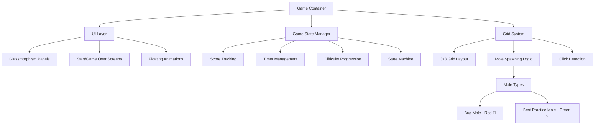
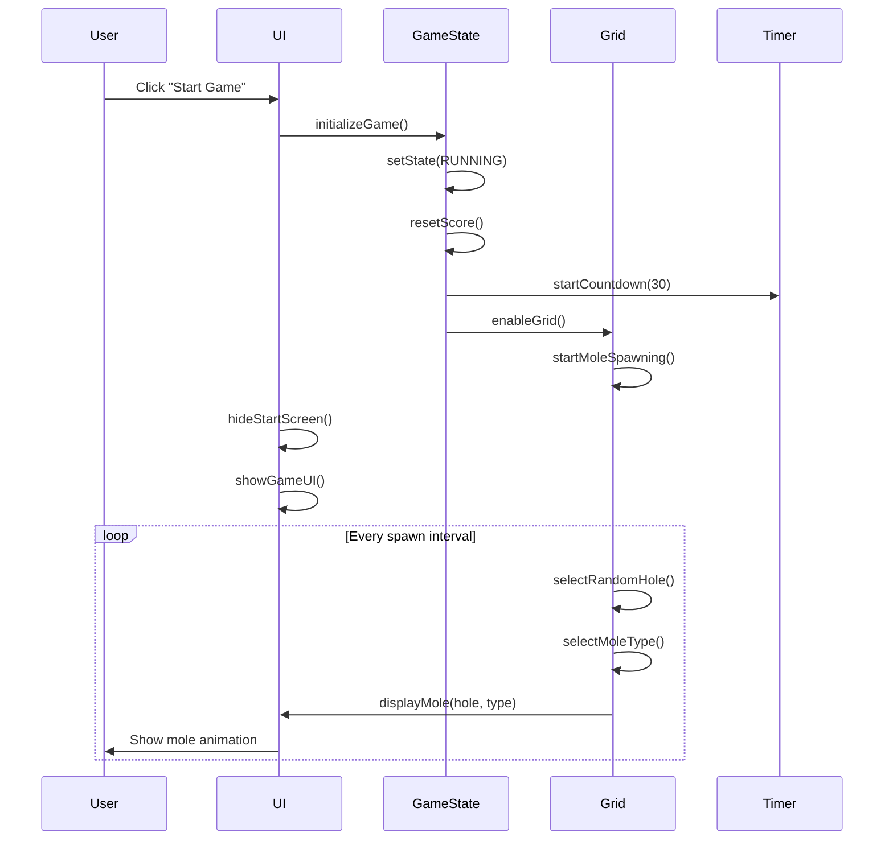
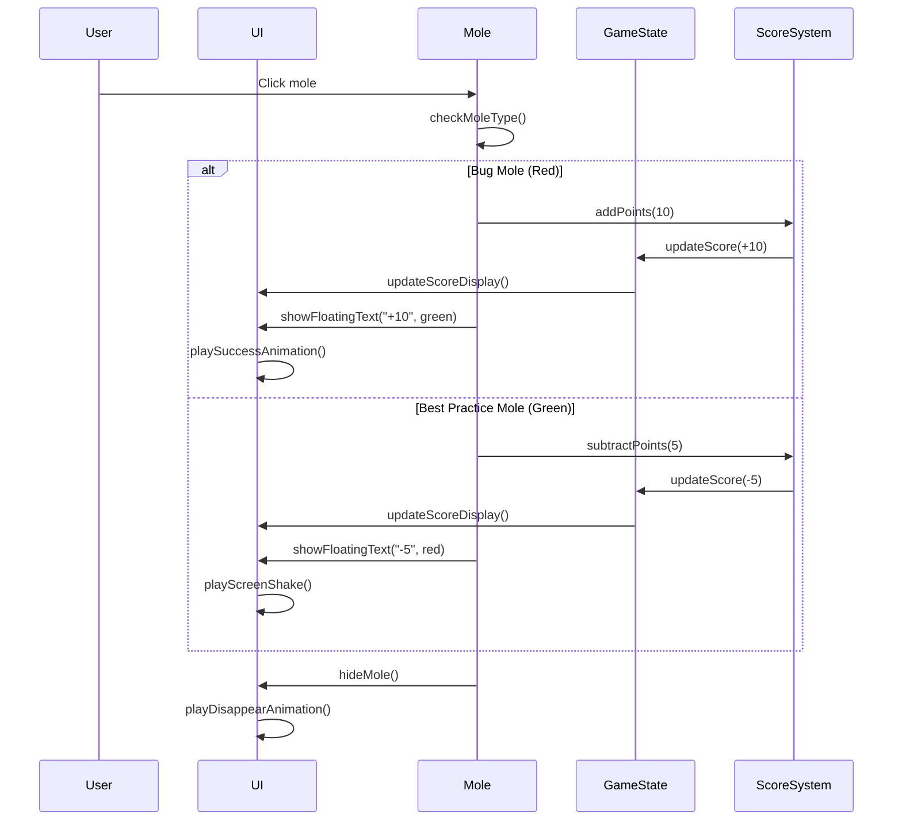
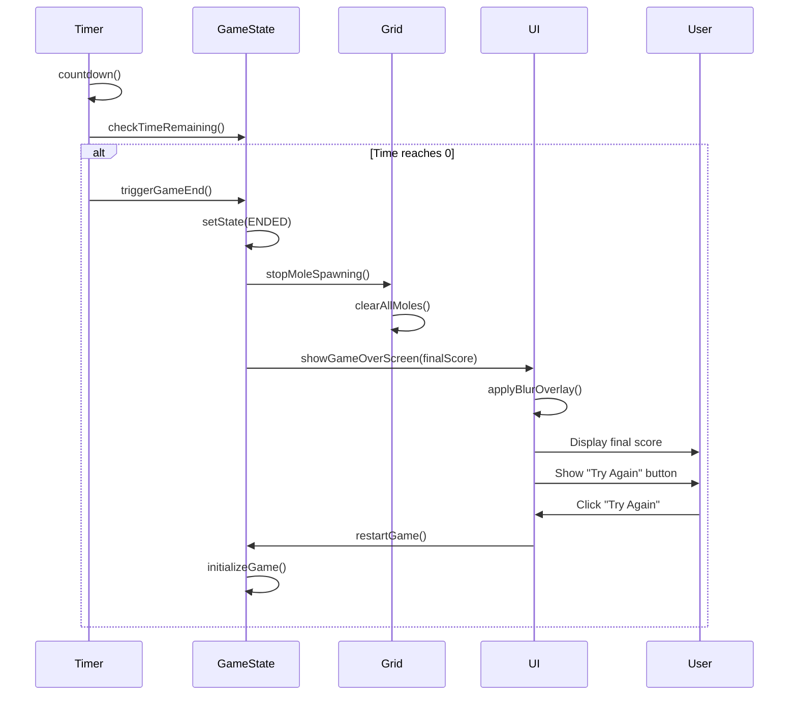
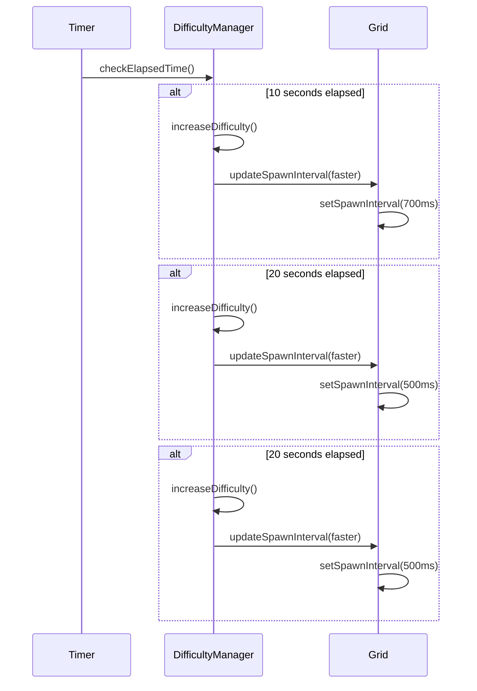

# Design Document: Premium Developer-Centric Whack-a-Mole Game Redesign

## Overview

This design document outlines the complete redesign of the 'Whack-a-Mole: Coding Edition' game with a premium, modern developer-centric aesthetic. The redesign transforms the existing random-positioning gameplay (engineering-whack.html) into a structured 3x3 grid system with terminal-inspired visuals, glassmorphism UI elements, and progressive difficulty mechanics. The game features a deep navy-to-charcoal gradient background with subtle code syntax overlay, glassmorphism panels for Score/Timer/Start controls, and clean monospaced typography (JetBrains Mono or Fira Code). Players click Bugs (🐛 red moles, +10 points) while avoiding Best Practices (✨ green moles, -5 points with screen shake). The 30-second game includes progressive difficulty scaling every 10 seconds, floating point animations, and a polished game-over experience. The implementation will be a single-file HTML application with embedded CSS and JavaScript for easy deployment and maintenance.

### Current Implementation Context

**Existing File**: `engineering-whack.html` - Contains random positioning gameplay implementation

**Redesign Scope**: This is a complete redesign with the following key changes:
- Random positioning → Structured 3x3 grid system
- Basic styling → Premium glassmorphism UI with developer-centric theme
- Simple mechanics → Progressive difficulty with enhanced visual feedback
- Basic animations → Floating point text, screen shake, hover glow effects
- Generic theme → Developer-focused with code syntax overlay and monospaced fonts

**Implementation Approach**: Single-file HTML with embedded CSS and JavaScript for portability and ease of deployment

## Architecture

The game follows a component-based architecture with clear separation between visual presentation, game state management, and user interaction handling.

### Game Instructions Display

**Start Screen Instructions**:
- Text: "Whack the Bugs (Red) and save the Best Practices (Green)!"
- Displayed prominently on start screen
- Uses monospaced typography for developer aesthetic
- Clear visual distinction between good targets (Bugs 🐛) and penalties (Best Practices ✨)

### Game Mechanics Summary

**Objective**: Click as many Bug moles (🐛) as possible while avoiding Best Practice moles (✨) within 30 seconds

**Scoring**:
- Bug mole (🐛 red): +10 points, shows floating green "+10"
- Best Practice mole (✨ green): -5 points, shows floating red "-5", triggers screen shake

**Difficulty Progression**:
- 0-10 seconds: Level 1, spawn interval 800ms
- 10-20 seconds: Level 2, spawn interval 700ms
- 20-30 seconds: Level 3, spawn interval 500ms

**Game Flow**:
1. Start screen with instructions and green "Start Game" button
2. 30-second gameplay with progressive difficulty
3. Game over screen with blurred overlay, final score, and "Try Again" button



## Sequence Diagrams

### Game Start Flow



### Mole Click Interaction Flow



### Game End Flow



### Progressive Difficulty Flow



## Components and Interfaces

### Visual Style Specifications

**Background**:
- Deep navy-to-charcoal linear gradient: `linear-gradient(135deg, #1a1f3a 0%, #2d3748 100%)`
- Subtle, low-opacity 'code syntax' or 'grid' overlay pattern (opacity: 0.05-0.15)
- Creates premium developer-centric atmosphere

**Glassmorphism Containers**:
- Applied to: Score panel, Timer panel, Start screen panel
- Style properties:
  - Semi-transparent background: `rgba(255, 255, 255, 0.1)`
  - Backdrop blur: `blur(10px)`
  - Thin white border: `1px solid rgba(255, 255, 255, 0.2)`
  - Border radius: `12px`
  - Padding: `20px`

**Typography**:
- Font family: `'JetBrains Mono', 'Fira Code', monospace`
- Clean monospaced font for developer feel
- Font sizes: Small (14px), Medium (18px), Large (24px), XLarge (32px)

**Grid System**:
- 3x3 grid of 'holes' styled as dark terminal windows or recessed circles
- Each hole: Dark background (#1e293b or similar), subtle inset shadow for depth
- Border: 2px solid rgba(255, 255, 255, 0.1) for terminal window effect
- Border radius: 8px for rounded corners
- Dimensions: Equal width/height, responsive to container size
- Gap between holes: 15-20px for clear separation
- Terminal-inspired aesthetic with code-like appearance

**Moles**:
- Bugs (Red): 🐛 icon, clicking gives +10 points with floating green '+10' animation
- Best Practices (Green): ✨ icon, clicking gives -5 points, triggers brief red screen-shake, shows floating red '-5'

**Start Screen**:
- Large vibrant green 'Start Game' button with hover-glow effect
- Instructions text: "Whack the Bugs (Red) and save the Best Practices (Green)!"
- Glassmorphism panel styling

**Game Over Screen**:
- Blurred overlay effect on background
- Final score display in large text
- 'Try Again' button with same styling as Start button

### Component 1: GameStateManager

**Purpose**: Manages the overall game state, score tracking, and game lifecycle

**Interface**:
```typescript
interface GameStateManager {
  state: GameState
  score: number
  timeRemaining: number
  
  initializeGame(): void
  startGame(): void
  endGame(): void
  updateScore(points: number): void
  getCurrentState(): GameState
}

enum GameState {
  IDLE = 'idle',
  RUNNING = 'running',
  ENDED = 'ended'
}
```

**Responsibilities**:
- Track current game state (IDLE, RUNNING, ENDED)
- Maintain score and time remaining
- Coordinate game start and end sequences
- Notify UI components of state changes


### Component 2: GridSystem

**Purpose**: Manages the 3x3 grid layout and mole spawning logic

**Interface**:
```typescript
interface GridSystem {
  holes: Hole[]
  spawnInterval: number
  
  initializeGrid(): void
  startSpawning(): void
  stopSpawning(): void
  spawnMole(): void
  getRandomAvailableHole(): Hole | null
  clearAllMoles(): void
  updateSpawnInterval(newInterval: number): void
}

interface Hole {
  id: number
  position: GridPosition
  isOccupied: boolean
  currentMole: Mole | null
}

interface GridPosition {
  row: number
  col: number
}
```

**Responsibilities**:
- Maintain 3x3 grid structure with 9 holes
- Track which holes are occupied
- Spawn moles at random available holes
- Manage spawn timing and intervals
- Clear moles when game ends


### Component 3: Mole

**Purpose**: Represents individual mole entities with type-specific behavior

**Interface**:
```typescript
interface Mole {
  type: MoleType
  displayDuration: number
  element: HTMLElement
  
  spawn(hole: Hole): void
  hide(): void
  onClick(): void
  getPointValue(): number
}

enum MoleType {
  BUG = 'bug',           // Red mole, +10 points
  BEST_PRACTICE = 'best_practice'  // Green mole, -5 points
}

interface MoleConfig {
  icon: string
  color: string
  pointValue: number
  label: string
}
```

**Responsibilities**:
- Display appropriate icon and styling based on type
- Handle click events
- Return correct point value when clicked
- Animate appearance and disappearance
- Auto-hide after display duration expires


### Component 4: UIManager

**Purpose**: Manages all visual elements, animations, and user interface updates

**Interface**:
```typescript
interface UIManager {
  scoreDisplay: HTMLElement
  timerDisplay: HTMLElement
  startScreen: HTMLElement
  gameOverScreen: HTMLElement
  
  updateScoreDisplay(score: number): void
  updateTimerDisplay(time: number): void
  showStartScreen(): void
  hideStartScreen(): void
  showGameOverScreen(finalScore: number): void
  hideGameOverScreen(): void
  showFloatingText(text: string, color: string, position: Position): void
  playScreenShake(): void
  applyBlurOverlay(): void
  removeBlurOverlay(): void
}

interface Position {
  x: number
  y: number
}
```

**Responsibilities**:
- Update score and timer displays
- Show/hide start and game over screens
- Create floating text animations for point changes
- Apply visual effects (screen shake, blur overlay)
- Manage glassmorphism panel styling


### Component 5: DifficultyManager

**Purpose**: Controls progressive difficulty by adjusting spawn rates over time

**Interface**:
```typescript
interface DifficultyManager {
  baseSpawnInterval: number
  currentLevel: number
  difficultyThresholds: DifficultyThreshold[]
  
  initialize(): void
  checkAndUpdateDifficulty(elapsedTime: number): void
  getSpawnInterval(): number
  reset(): void
}

interface DifficultyThreshold {
  timeThreshold: number  // Seconds elapsed
  spawnInterval: number  // Milliseconds between spawns
  level: number
}
```

**Responsibilities**:
- Monitor elapsed game time
- Increase difficulty at 10-second and 20-second marks
- Adjust mole spawn intervals (800ms → 700ms → 500ms)
- Reset difficulty when game restarts


### Component 6: TimerManager

**Purpose**: Manages the 30-second countdown timer

**Interface**:
```typescript
interface TimerManager {
  timeRemaining: number
  intervalId: number | null
  
  start(duration: number, onTick: (time: number) => void, onComplete: () => void): void
  stop(): void
  reset(): void
  getTimeRemaining(): number
}
```

**Responsibilities**:
- Count down from 30 seconds to 0
- Trigger callbacks on each second tick
- Trigger game end callback when time reaches 0
- Allow pausing and resetting


## Data Models

### Model 1: GameConfig

```typescript
interface GameConfig {
  gameDuration: number          // 30 seconds
  gridSize: GridSize
  moleDisplayDuration: number   // 2000ms
  initialSpawnInterval: number  // 800ms
  difficultyLevels: DifficultyLevel[]
  moleTypes: MoleTypeConfig[]
}

interface GridSize {
  rows: number  // 3
  cols: number  // 3
}

interface DifficultyLevel {
  startTime: number      // When this level activates (seconds)
  spawnInterval: number  // Milliseconds between spawns
}

interface MoleTypeConfig {
  type: MoleType
  icon: string  // Bug: 🐛 (red), Best Practice: ✨ (green)
  color: string
  pointValue: number
  spawnProbability: number  // 0.0 to 1.0
}
```

**Validation Rules**:
- gameDuration must be positive integer
- gridSize rows and cols must be positive integers
- moleDisplayDuration must be less than gameDuration
- spawnInterval must be positive
- spawnProbability must be between 0 and 1
- Sum of all moleTypes spawnProbability should equal 1.0


### Model 2: GameSession

```typescript
interface GameSession {
  sessionId: string
  startTime: number
  endTime: number | null
  finalScore: number
  clicks: ClickEvent[]
  maxCombo: number
}

interface ClickEvent {
  timestamp: number
  moleType: MoleType
  pointsAwarded: number
  holeId: number
  reactionTime: number  // Milliseconds from spawn to click
}
```

**Validation Rules**:
- sessionId must be unique
- startTime must be valid timestamp
- endTime must be after startTime if not null
- finalScore can be negative
- clicks array must be chronologically ordered
- reactionTime must be positive and less than moleDisplayDuration


### Model 3: VisualTheme

```typescript
interface VisualTheme {
  background: BackgroundStyle
  glassmorphism: GlassmorphismStyle
  typography: TypographyStyle
  colors: ColorPalette
  animations: AnimationConfig
}

interface BackgroundStyle {
  gradient: string  // "linear-gradient(135deg, #1a1f3a 0%, #2d3748 100%)" - Deep navy to charcoal
  overlayPattern: string  // "code-syntax" or "grid" - Subtle code syntax overlay preferred
  overlayOpacity: number  // Low opacity (0.05 to 0.15 recommended)
}

interface GlassmorphismStyle {
  backgroundColor: string  // "rgba(255, 255, 255, 0.1)"
  backdropBlur: string     // "10px"
  borderColor: string      // "rgba(255, 255, 255, 0.2)"
  borderWidth: string      // "1px"
}

interface TypographyStyle {
  fontFamily: string  // "JetBrains Mono, Fira Code, monospace" - Clean monospaced developer fonts
  fontSize: FontSizes
}

interface FontSizes {
  small: string   // "14px"
  medium: string  // "18px"
  large: string   // "24px"
  xlarge: string  // "32px"
}

interface ColorPalette {
  bugRed: string           // "#ef4444"
  bestPracticeGreen: string // "#10b981"
  textPrimary: string      // "#ffffff"
  textSecondary: string    // "#a0aec0"
  success: string          // "#22c55e"
  error: string            // "#ef4444"
}

interface AnimationConfig {
  floatingTextDuration: number  // 1000ms - Floating green '+10' or red '-5' animations
  screenShakeDuration: number   // 300ms - Brief red screen shake on Best Practice click
  molePopDuration: number       // 400ms
  buttonHoverGlow: string       // "0 0 20px rgba(16, 185, 129, 0.6)" - Vibrant green glow on Start button hover
}
```

**Validation Rules**:
- All color values must be valid CSS colors
- All duration values must be positive integers
- overlayOpacity must be between 0 and 1
- Font family must be available or have fallback


## Algorithmic Pseudocode

### Main Game Loop Algorithm

```typescript
function gameLoop(): void
  // Main game loop that runs during active gameplay
  
  // Preconditions:
  // - gameState === GameState.RUNNING
  // - timer is active and counting down
  // - grid is initialized with 9 holes
  
  while (gameState === GameState.RUNNING) {
    currentTime = getCurrentTime()
    elapsedTime = currentTime - gameStartTime
    
    // Check and update difficulty based on elapsed time
    difficultyManager.checkAndUpdateDifficulty(elapsedTime)
    
    // Spawn moles at current difficulty interval
    if (shouldSpawnMole(currentTime, lastSpawnTime, spawnInterval)) {
      spawnMole()
      lastSpawnTime = currentTime
    }
    
    // Update timer display
    timeRemaining = gameDuration - elapsedTime
    uiManager.updateTimerDisplay(timeRemaining)
    
    // Check for game end condition
    if (timeRemaining <= 0) {
      endGame()
      break
    }
    
    // Loop invariant: All active moles have valid spawn times
    // Loop invariant: Score is consistent with click history
    // Loop invariant: timeRemaining >= 0 or game ends
  }
  
  // Postconditions:
  // - gameState === GameState.ENDED
  // - All moles are cleared from grid
  // - Final score is displayed
```


### Mole Spawning Algorithm

```typescript
function spawnMole(): void
  // Spawns a new mole in a random available hole
  
  // Preconditions:
  // - gameState === GameState.RUNNING
  // - grid is initialized
  // - At least one hole is available (not occupied)
  
  availableHoles = grid.holes.filter(hole => !hole.isOccupied)
  
  if (availableHoles.length === 0) {
    return  // No available holes, skip this spawn
  }
  
  // Select random hole
  randomIndex = Math.floor(Math.random() * availableHoles.length)
  selectedHole = availableHoles[randomIndex]
  
  // Determine mole type (50% bug, 50% best practice)
  moleType = Math.random() < 0.5 ? MoleType.BUG : MoleType.BEST_PRACTICE
  
  // Create and configure mole
  mole = createMole(moleType)
  mole.spawnTime = getCurrentTime()
  mole.hole = selectedHole
  
  // Mark hole as occupied
  selectedHole.isOccupied = true
  selectedHole.currentMole = mole
  
  // Display mole with animation
  uiManager.displayMole(mole, selectedHole.position)
  
  // Schedule auto-hide after display duration
  setTimeout(() => {
    if (mole.isVisible && gameState === GameState.RUNNING) {
      hideMole(mole)
    }
  }, moleDisplayDuration)
  
  // Postconditions:
  // - selectedHole.isOccupied === true
  // - Mole is visible in the grid
  // - Auto-hide timer is scheduled
```


### Mole Click Handling Algorithm

```typescript
function handleMoleClick(mole: Mole): void
  // Processes click event on a mole
  
  // Preconditions:
  // - gameState === GameState.RUNNING
  // - mole is visible and not already clicked
  // - mole.hole is valid and occupied
  
  if (gameState !== GameState.RUNNING || mole.isClicked) {
    return  // Ignore clicks outside active gameplay or duplicate clicks
  }
  
  // Mark mole as clicked to prevent double-processing
  mole.isClicked = true
  
  // Calculate reaction time
  reactionTime = getCurrentTime() - mole.spawnTime
  
  // Determine points based on mole type
  if (mole.type === MoleType.BUG) {
    pointsAwarded = 10
    textColor = 'green'
    floatingText = '+10'
    
    // Play success animation
    uiManager.playSuccessAnimation()
  } else {  // MoleType.BEST_PRACTICE
    pointsAwarded = -5
    textColor = 'red'
    floatingText = '-5'
    
    // Play error animation (screen shake)
    uiManager.playScreenShake()
  }
  
  // Update score
  gameState.updateScore(pointsAwarded)
  uiManager.updateScoreDisplay(gameState.score)
  
  // Show floating text at mole position
  molePosition = getMoleScreenPosition(mole)
  uiManager.showFloatingText(floatingText, textColor, molePosition)
  
  // Record click event
  clickEvent = {
    timestamp: getCurrentTime(),
    moleType: mole.type,
    pointsAwarded: pointsAwarded,
    holeId: mole.hole.id,
    reactionTime: reactionTime
  }
  gameSession.clicks.push(clickEvent)
  
  // Hide mole with animation
  hideMole(mole)
  
  // Postconditions:
  // - Score is updated correctly
  // - Mole is hidden and hole is freed
  // - Click event is recorded
  // - Appropriate visual feedback is shown
```


### Difficulty Progression Algorithm

```typescript
function checkAndUpdateDifficulty(elapsedTime: number): void
  // Adjusts spawn interval based on elapsed game time
  
  // Preconditions:
  // - elapsedTime >= 0
  // - elapsedTime <= gameDuration
  // - difficultyLevels array is sorted by startTime
  
  // Difficulty thresholds:
  // Level 1 (0-10s): 800ms spawn interval
  // Level 2 (10-20s): 700ms spawn interval
  // Level 3 (20-30s): 500ms spawn interval
  
  newLevel = currentLevel
  newSpawnInterval = spawnInterval
  
  for each level in difficultyLevels {
    if (elapsedTime >= level.startTime && level.level > currentLevel) {
      newLevel = level.level
      newSpawnInterval = level.spawnInterval
    }
  }
  
  // Update if difficulty changed
  if (newLevel !== currentLevel) {
    currentLevel = newLevel
    spawnInterval = newSpawnInterval
    
    // Optional: Show difficulty increase notification
    uiManager.showNotification(`Difficulty increased to Level ${newLevel}!`)
  }
  
  // Postconditions:
  // - currentLevel reflects appropriate difficulty for elapsedTime
  // - spawnInterval is updated to match current level
  // - Spawn rate increases as game progresses
  
  // Loop invariant (when called repeatedly):
  // - currentLevel never decreases
  // - spawnInterval never increases
```


### Grid Initialization Algorithm

```typescript
function initializeGrid(): Hole[]
  // Creates 3x3 grid of holes with proper positioning
  
  // Preconditions:
  // - gridSize.rows === 3
  // - gridSize.cols === 3
  
  holes = []
  holeId = 0
  
  for (row = 0; row < gridSize.rows; row++) {
    for (col = 0; col < gridSize.cols; col++) {
      hole = {
        id: holeId,
        position: { row: row, col: col },
        isOccupied: false,
        currentMole: null
      }
      holes.push(hole)
      holeId++
    }
  }
  
  // Postconditions:
  // - holes.length === 9
  // - All holes have unique IDs (0-8)
  // - All holes are initially unoccupied
  // - Holes are ordered by row-major traversal
  
  return holes
```


## Key Functions with Formal Specifications

### Function 1: startGame()

```typescript
function startGame(): void
```

**Preconditions:**
- gameState === GameState.IDLE or gameState === GameState.ENDED
- Grid is initialized with 9 holes
- All UI elements are properly loaded

**Postconditions:**
- gameState === GameState.RUNNING
- score === 0
- timeRemaining === 30
- Timer countdown is active
- Mole spawning is active
- Start screen is hidden
- Game UI is visible

**Loop Invariants:** N/A (no loops in function body)

### Function 2: endGame()

```typescript
function endGame(): void
```

**Preconditions:**
- gameState === GameState.RUNNING
- Timer has reached 0 or manual end triggered

**Postconditions:**
- gameState === GameState.ENDED
- Timer is stopped
- Mole spawning is stopped
- All active moles are cleared from grid
- Game over screen is visible with final score
- Blur overlay is applied to background
- "Try Again" button is visible

**Loop Invariants:** N/A (no loops in function body)


### Function 3: updateScore(points: number)

```typescript
function updateScore(points: number): void
```

**Preconditions:**
- gameState === GameState.RUNNING
- points is a valid integer (can be positive or negative)

**Postconditions:**
- score is updated by adding points value
- Score display in UI reflects new score
- Score can be negative if enough penalties accumulated
- No side effects on other game state

**Loop Invariants:** N/A (no loops in function body)

### Function 4: hideMole(mole: Mole)

```typescript
function hideMole(mole: Mole): void
```

**Preconditions:**
- mole is a valid Mole instance
- mole.hole is not null
- mole.hole.isOccupied === true

**Postconditions:**
- mole.isVisible === false
- mole.hole.isOccupied === false
- mole.hole.currentMole === null
- Mole element is removed from DOM with animation
- Hole is available for new mole spawns

**Loop Invariants:** N/A (no loops in function body)


### Function 5: showFloatingText(text: string, color: string, position: Position)

```typescript
function showFloatingText(text: string, color: string, position: Position): void
```

**Preconditions:**
- text is non-empty string
- color is valid CSS color value
- position contains valid x and y coordinates within viewport

**Postconditions:**
- Floating text element is created and added to DOM
- Text appears at specified position with specified color
- Animation plays for floatingTextDuration (1000ms)
- Element is automatically removed from DOM after animation completes
- No memory leaks from orphaned elements

**Loop Invariants:** N/A (no loops in function body)

### Function 6: playScreenShake()

```typescript
function playScreenShake(): void
```

**Preconditions:**
- Game container element exists in DOM
- No other screen shake animation is currently playing

**Postconditions:**
- Screen shake animation plays for screenShakeDuration (300ms)
- Game container returns to original position after animation
- Animation can be interrupted by subsequent calls
- No permanent transform applied to container

**Loop Invariants:** N/A (no loops in function body)


## Example Usage

### Example 1: Complete Game Flow

```typescript
// Initialize game on page load
document.addEventListener('DOMContentLoaded', () => {
  const game = new WhackAMoleGame({
    gameDuration: 30,
    gridSize: { rows: 3, cols: 3 },
    moleDisplayDuration: 2000,
    initialSpawnInterval: 800,
    difficultyLevels: [
      { startTime: 0, spawnInterval: 800, level: 1 },
      { startTime: 10, spawnInterval: 700, level: 2 },
      { startTime: 20, spawnInterval: 500, level: 3 }
    ]
  })
  
  // Start game when user clicks start button
  document.getElementById('startButton').addEventListener('click', () => {
    game.startGame()
  })
  
  // Restart game when user clicks try again
  document.getElementById('tryAgainButton').addEventListener('click', () => {
    game.restartGame()
  })
})
```

### Example 2: Mole Click Handling

```typescript
// Handle mole click event
function setupMoleClickHandler(mole: Mole) {
  mole.element.addEventListener('click', () => {
    if (gameState !== GameState.RUNNING || mole.isClicked) {
      return
    }
    
    handleMoleClick(mole)
  })
}

// Process the click
function handleMoleClick(mole: Mole) {
  const points = mole.type === MoleType.BUG ? 10 : -5
  updateScore(points)
  
  const position = getMolePosition(mole)
  showFloatingText(
    points > 0 ? '+10' : '-5',
    points > 0 ? '#22c55e' : '#ef4444',
    position
  )
  
  if (points < 0) {
    playScreenShake()
  }
  
  hideMole(mole)
}
```


### Example 3: Grid System Usage

```typescript
// Initialize 3x3 grid
const grid = initializeGrid()

// Spawn mole in random available hole
function spawnRandomMole() {
  const availableHoles = grid.filter(hole => !hole.isOccupied)
  
  if (availableHoles.length === 0) {
    return null
  }
  
  const randomHole = availableHoles[
    Math.floor(Math.random() * availableHoles.length)
  ]
  
  const moleType = Math.random() < 0.5 
    ? MoleType.BUG 
    : MoleType.BEST_PRACTICE
  
  const mole = createMole(moleType, randomHole)
  randomHole.isOccupied = true
  randomHole.currentMole = mole
  
  return mole
}
```

### Example 4: Difficulty Progression

```typescript
// Check and update difficulty every second
setInterval(() => {
  if (gameState !== GameState.RUNNING) return
  
  const elapsedTime = (Date.now() - gameStartTime) / 1000
  
  if (elapsedTime >= 20 && currentLevel < 3) {
    currentLevel = 3
    spawnInterval = 500
    console.log('Difficulty increased to Level 3')
  } else if (elapsedTime >= 10 && currentLevel < 2) {
    currentLevel = 2
    spawnInterval = 700
    console.log('Difficulty increased to Level 2')
  }
}, 1000)
```


### Example 5: Glassmorphism UI Styling

```typescript
// Apply glassmorphism styling to panels
function applyGlassmorphism(element: HTMLElement) {
  element.style.backgroundColor = 'rgba(255, 255, 255, 0.1)'
  element.style.backdropFilter = 'blur(10px)'
  element.style.border = '1px solid rgba(255, 255, 255, 0.2)'
  element.style.borderRadius = '12px'
  element.style.padding = '20px'
}

// Apply to score and timer panels
const scorePanel = document.getElementById('scorePanel')
const timerPanel = document.getElementById('timerPanel')

applyGlassmorphism(scorePanel)
applyGlassmorphism(timerPanel)
```

### Example 6: Floating Text Animation

```typescript
// Create floating text animation
function showFloatingText(text: string, color: string, position: Position) {
  const floatingText = document.createElement('div')
  floatingText.textContent = text
  floatingText.style.position = 'absolute'
  floatingText.style.left = `${position.x}px`
  floatingText.style.top = `${position.y}px`
  floatingText.style.color = color
  floatingText.style.fontSize = '24px'
  floatingText.style.fontWeight = 'bold'
  floatingText.style.fontFamily = 'JetBrains Mono, monospace'
  floatingText.style.pointerEvents = 'none'
  floatingText.style.animation = 'floatUp 1s ease-out forwards'
  
  document.body.appendChild(floatingText)
  
  setTimeout(() => {
    floatingText.remove()
  }, 1000)
}

// CSS animation
const style = document.createElement('style')
style.textContent = `
  @keyframes floatUp {
    0% {
      opacity: 1;
      transform: translateY(0);
    }
    100% {
      opacity: 0;
      transform: translateY(-50px);
    }
  }
`
document.head.appendChild(style)
```


## Correctness Properties

### Property 1: Score Consistency
**Universal Quantification**: ∀ game sessions, the final score equals the sum of all point awards from click events

```typescript
// Verification function
function verifyScoreConsistency(session: GameSession): boolean {
  const calculatedScore = session.clicks.reduce(
    (sum, click) => sum + click.pointsAwarded, 
    0
  )
  return calculatedScore === session.finalScore
}
```

### Property 2: Grid Occupancy Invariant
**Universal Quantification**: ∀ holes in grid, at most one mole occupies a hole at any given time

```typescript
// Verification function
function verifyGridOccupancy(grid: Hole[]): boolean {
  return grid.every(hole => {
    if (hole.isOccupied) {
      return hole.currentMole !== null
    } else {
      return hole.currentMole === null
    }
  })
}
```

### Property 3: Timer Monotonicity
**Universal Quantification**: ∀ time measurements during gameplay, timeRemaining never increases

```typescript
// Verification function
function verifyTimerMonotonicity(timeReadings: number[]): boolean {
  for (let i = 1; i < timeReadings.length; i++) {
    if (timeReadings[i] > timeReadings[i - 1]) {
      return false
    }
  }
  return true
}
```


### Property 4: Difficulty Progression
**Universal Quantification**: ∀ difficulty level changes, spawn interval never increases (only decreases or stays same)

```typescript
// Verification function
function verifyDifficultyProgression(intervalHistory: number[]): boolean {
  for (let i = 1; i < intervalHistory.length; i++) {
    if (intervalHistory[i] > intervalHistory[i - 1]) {
      return false
    }
  }
  return true
}
```

### Property 5: Mole Type Distribution
**Universal Quantification**: Over a large number of spawns, bug moles and best practice moles appear with approximately equal frequency (50% each)

```typescript
// Verification function
function verifyMoleDistribution(spawns: Mole[], tolerance: number = 0.1): boolean {
  const bugCount = spawns.filter(m => m.type === MoleType.BUG).length
  const bestPracticeCount = spawns.filter(m => m.type === MoleType.BEST_PRACTICE).length
  const total = spawns.length
  
  if (total === 0) return true
  
  const bugRatio = bugCount / total
  const expectedRatio = 0.5
  
  return Math.abs(bugRatio - expectedRatio) <= tolerance
}
```

### Property 6: Game State Transitions
**Universal Quantification**: ∀ state transitions, valid transitions are IDLE → RUNNING → ENDED → IDLE (no invalid transitions)

```typescript
// Verification function
function verifyStateTransition(fromState: GameState, toState: GameState): boolean {
  const validTransitions = {
    [GameState.IDLE]: [GameState.RUNNING],
    [GameState.RUNNING]: [GameState.ENDED],
    [GameState.ENDED]: [GameState.IDLE, GameState.RUNNING]
  }
  
  return validTransitions[fromState]?.includes(toState) ?? false
}
```


### Property 7: Mole Lifetime Bounds
**Universal Quantification**: ∀ moles spawned, mole is visible for at most moleDisplayDuration (2000ms) unless clicked

```typescript
// Verification function
function verifyMoleLifetime(mole: Mole, maxDuration: number = 2000): boolean {
  const lifetime = mole.hideTime - mole.spawnTime
  return lifetime <= maxDuration
}
```

### Property 8: Click Event Ordering
**Universal Quantification**: ∀ click events in a session, events are chronologically ordered by timestamp

```typescript
// Verification function
function verifyClickOrdering(clicks: ClickEvent[]): boolean {
  for (let i = 1; i < clicks.length; i++) {
    if (clicks[i].timestamp < clicks[i - 1].timestamp) {
      return false
    }
  }
  return true
}
```

### Property 9: Point Value Correctness
**Universal Quantification**: ∀ mole clicks, bug moles award exactly +10 points and best practice moles award exactly -5 points

```typescript
// Verification function
function verifyPointValues(click: ClickEvent): boolean {
  if (click.moleType === MoleType.BUG) {
    return click.pointsAwarded === 10
  } else if (click.moleType === MoleType.BEST_PRACTICE) {
    return click.pointsAwarded === -5
  }
  return false
}
```


## Error Handling

### Error Scenario 1: No Available Holes

**Condition**: All 9 holes in the grid are currently occupied when attempting to spawn a new mole

**Response**: Skip the spawn attempt without throwing an error; wait for next spawn interval

**Recovery**: As moles auto-hide after 2 seconds, holes will become available naturally; system continues normal operation

### Error Scenario 2: Duplicate Click on Same Mole

**Condition**: User clicks the same mole multiple times in rapid succession

**Response**: Ignore subsequent clicks after the first click is processed; use `mole.isClicked` flag to prevent double-processing

**Recovery**: No recovery needed; mole is hidden after first click and subsequent clicks have no effect

### Error Scenario 3: Timer Drift

**Condition**: System timer becomes inaccurate due to browser tab being backgrounded or system sleep

**Response**: Use `Date.now()` for absolute time measurements rather than relying on interval counts; recalculate elapsed time on each tick

**Recovery**: Timer self-corrects on next tick by comparing current time to game start time

### Error Scenario 4: Invalid Mole Type

**Condition**: Mole spawns with a type that is not BUG or BEST_PRACTICE

**Response**: Default to BUG type and log warning to console; continue game operation

**Recovery**: System continues with default mole type; no user-visible error


### Error Scenario 5: DOM Element Not Found

**Condition**: Required DOM elements (score display, timer display, grid container) are not found during initialization

**Response**: Throw initialization error with descriptive message; prevent game from starting

**Recovery**: Display error message to user; require page reload to retry initialization

### Error Scenario 6: Rapid Restart Clicks

**Condition**: User clicks "Try Again" button multiple times rapidly

**Response**: Disable button after first click; re-enable after game initialization completes

**Recovery**: Button becomes clickable again once new game is ready; prevents multiple simultaneous game instances

### Error Scenario 7: Animation Memory Leak

**Condition**: Floating text elements or mole elements are not properly removed from DOM

**Response**: Use `setTimeout` with guaranteed cleanup; track all created elements in a cleanup queue

**Recovery**: Force cleanup of all animation elements when game ends; clear cleanup queue on game restart

### Error Scenario 8: Negative Score Display

**Condition**: User clicks too many best practice moles, resulting in negative score

**Response**: Allow negative scores; display with minus sign; no minimum score limit

**Recovery**: No recovery needed; this is valid gameplay outcome; user can recover by clicking bug moles


## Testing Strategy

### Unit Testing Approach

The game will be tested using component-level unit tests to verify individual functions and state management logic. Key test cases include:

1. **GameStateManager Tests**
   - Test state transitions (IDLE → RUNNING → ENDED)
   - Test score updates with positive and negative values
   - Test timer countdown accuracy
   - Test game initialization and reset

2. **GridSystem Tests**
   - Test grid initialization creates exactly 9 holes
   - Test hole occupancy tracking
   - Test random hole selection excludes occupied holes
   - Test mole spawning respects grid constraints

3. **Mole Tests**
   - Test mole type assignment (BUG vs BEST_PRACTICE)
   - Test point value calculation based on type
   - Test mole visibility lifecycle
   - Test click event handling

4. **DifficultyManager Tests**
   - Test difficulty progression at 10s and 20s marks
   - Test spawn interval updates
   - Test difficulty never decreases

5. **UIManager Tests**
   - Test score display updates
   - Test timer display updates
   - Test screen transitions (start → game → game over)
   - Test floating text creation and cleanup


### Property-Based Testing Approach

Property-based testing will verify correctness properties hold across many randomly generated game scenarios.

**Property Test Library**: fast-check (JavaScript/TypeScript property-based testing library)

**Key Properties to Test**:

1. **Score Consistency Property**
   - Generate random sequences of mole clicks
   - Verify final score equals sum of all point awards
   - Test with various combinations of bug and best practice clicks

2. **Grid Occupancy Property**
   - Generate random spawn sequences
   - Verify no hole ever has more than one mole
   - Verify isOccupied flag matches currentMole state

3. **Timer Monotonicity Property**
   - Generate random game durations
   - Verify time remaining never increases
   - Verify timer reaches exactly 0 at game end

4. **Difficulty Progression Property**
   - Generate random game timelines
   - Verify spawn interval never increases
   - Verify difficulty levels activate at correct times

5. **Mole Distribution Property**
   - Generate large numbers of mole spawns (1000+)
   - Verify bug/best practice ratio approaches 50/50
   - Use statistical tolerance of ±10%

6. **State Transition Property**
   - Generate random sequences of game actions
   - Verify all state transitions are valid
   - Verify no invalid state transitions occur


### Integration Testing Approach

Integration tests will verify the complete game flow from start to finish, testing interactions between components.

**Test Scenarios**:

1. **Complete Game Flow Test**
   - Start game from idle state
   - Verify timer starts counting down
   - Verify moles spawn at correct intervals
   - Click multiple moles (both types)
   - Verify score updates correctly
   - Wait for timer to reach 0
   - Verify game over screen appears
   - Verify final score matches expected value

2. **Difficulty Progression Test**
   - Start game and track spawn intervals
   - Verify spawn interval is 800ms at start
   - Wait 10 seconds, verify interval changes to 700ms
   - Wait 20 seconds, verify interval changes to 500ms
   - Verify moles spawn faster as game progresses

3. **Restart Flow Test**
   - Complete a full game
   - Click "Try Again" button
   - Verify game resets to initial state
   - Verify score resets to 0
   - Verify timer resets to 30
   - Verify difficulty resets to level 1

4. **Visual Feedback Test**
   - Click bug mole, verify green "+10" appears
   - Click best practice mole, verify red "-5" appears
   - Verify screen shake occurs on penalty
   - Verify floating text disappears after animation

5. **Edge Case Test**
   - Fill all 9 holes with moles
   - Verify spawn attempt is skipped gracefully
   - Click moles to free holes
   - Verify spawning resumes normally


## Performance Considerations

### Rendering Optimization

- Use CSS transforms for animations instead of position changes (GPU-accelerated)
- Implement object pooling for mole elements to avoid frequent DOM creation/destruction
- Limit maximum number of simultaneous floating text animations to prevent DOM bloat
- Use `requestAnimationFrame` for smooth animations instead of `setInterval` where applicable

### Memory Management

- Remove event listeners when moles are hidden to prevent memory leaks
- Clear all intervals and timeouts when game ends
- Implement cleanup queue for animation elements
- Reuse mole DOM elements instead of creating new ones for each spawn

### Spawn Rate Limits

- Maximum 9 simultaneous moles (one per hole)
- Minimum spawn interval of 500ms (level 3 difficulty)
- Auto-hide moles after 2000ms to ensure holes become available
- Skip spawn attempts when no holes available (graceful degradation)

### Animation Performance

- Use CSS animations with `will-change` property for better performance
- Limit screen shake to 300ms to avoid motion sickness
- Cap floating text animations at 1000ms
- Use `transform: translateZ(0)` to force GPU acceleration

### Browser Compatibility

- Target modern browsers with CSS Grid and backdrop-filter support
- Provide fallback for backdrop-filter (solid background) for older browsers
- Use standard JavaScript (ES6+) without framework dependencies
- Test on Chrome, Firefox, Safari, and Edge


## Security Considerations

### Input Validation

- Validate all configuration values (game duration, spawn intervals, grid size)
- Ensure spawn intervals are positive numbers
- Ensure grid dimensions are positive integers
- Prevent negative or zero game duration

### XSS Prevention

- Sanitize any user-generated content (if leaderboard feature added in future)
- Use `textContent` instead of `innerHTML` for dynamic text
- Avoid `eval()` or `Function()` constructor
- No external script injection points

### Client-Side State Integrity

- Prevent score manipulation through browser console (accept as limitation for client-side game)
- Use closure patterns to encapsulate game state
- Avoid exposing critical game functions to global scope
- Consider adding checksum validation for score if leaderboard added

### Resource Exhaustion

- Limit maximum number of DOM elements created
- Implement cleanup for all animations and timers
- Prevent infinite loops in spawn logic
- Cap maximum game duration to prevent indefinite resource usage

### Privacy

- No personal data collection in base implementation
- No cookies or local storage required for core functionality
- No external API calls or data transmission
- Game runs entirely client-side

## Dependencies

### External Dependencies

**None** - The game is designed as a self-contained single-file HTML application with no external dependencies.

### Font Loading

**Primary Fonts**: JetBrains Mono, Fira Code
- Loaded via Google Fonts CDN or similar font service
- Fallback to system monospace font if CDN unavailable
- Font loading does not block game initialization

### Browser Requirements

**Minimum Browser Support**:
- Chrome 90+
- Firefox 88+
- Safari 14+
- Edge 90+

**Required Browser Features**:
- CSS Grid Layout
- CSS backdrop-filter (glassmorphism effect)
- ES6+ JavaScript support
- CSS animations and transforms
- Emoji rendering support (🐛 ✨)

**Graceful Degradation**:
- If backdrop-filter unsupported: Fall back to solid semi-transparent background
- If custom fonts fail to load: Use system monospace font
- If emoji unsupported: Use text labels ("BUG", "BEST")

### File Structure

**Single File**: `premium-developer-whack-a-mole.html`

**Embedded Content**:
- HTML structure
- CSS styles (including animations, glassmorphism, grid layout)
- JavaScript game logic (all components, state management, event handlers)
- No external CSS or JS files required
- No image assets required (uses emoji icons)

**Deployment**: Simply open the HTML file in a modern browser - no build process, no server required
